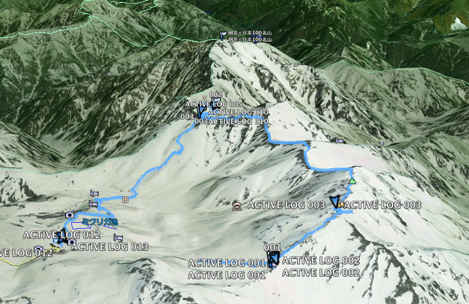

2013年7月，五個朋友一起前往日本北陸，挑戰立山劍岳。受電影「劍岳．點之記」感召，雖然最終沒能攻頂，但留下了難忘的山旅記憶。

<!-- more -->

日期: 2013-07-21 ~ 2013-07-25

人員: 林小黑, kalas, james, sky, moogoo

幾年前因為台灣上映了「劍岳．點之記」，幾個朋友一直嚮往之，突然就決定了這個行程。主啾人林小黑規劃行程，kalas的日文幫我們一路解決許多困難。雖然最後沒攻頂，但這次的行程也算圓滿結束。

## 立山

立山、富士山、白山為日本三靈山之一，自古以來就是山岳信仰濃厚的地方。其中立山又稱為日本阿爾卑斯山、日本屋脊，位於富山縣跟長野縣的交界，從富山縣的立山車站到長野縣的信濃大町，可以坐大眾交通工具通過。

一般攀登劍岳有2條路線，大部分都是走別山尾根 (南稜)，另一個是早月尾根 (北稜)，因為劍岳電影的影響，最近也常有隊伍走長次郎雪溪登頂。

我們的GPS航跡:



## 行前準備

### 列印地形圖

花了一點時間自製列印日本地形圖。

### GPS 圖資

在mobile 01看到神人大大分享的日本GPS地圖，馬上下載來用。

[讓你的Garmin台灣機的延伸到日本 - Mobile01](http://www.mobile01.com/topicdetail.php?f=228&t=500771&p=1)

開啟了久違的Windows XP環境，解壓檔案後放在 `C:\Program Files\Garmin\JAPANTOPO`，改註冊檔:

```
[HKEY_LOCAL_MACHINE\SOFTWARE\Garmin\MapSource\Products\JapanTopo]
"LOC"="C:\\Program Files\\GARMIN\\JAPANTOPO\\"
"BMAP"="C:\\Program Files\\GARMIN\\JAPANTOPO\\JapanTopo.img"
"TDB"="C:\\Program Files\\GARMIN\\JAPANTOPO\\JapanTopo.TDB"
```

開啟Garmin的Map Source程式，果然就有日本的地形圖了。接上Garmin 60csx，要傳輸地圖資訊時會出現 "this device 不能傳..." 之類的，換一張新的SD卡就可以了。

## 第一天 (7/21) 台北 → 富山


7:40華航往富山包機，人不多，位子大概坐了六、七成。因為錯過進市區的巴士，在機場等了50分鐘，機場只有一間土產賣店，有點難打發時間。到了富山車站前的[Comfort Hotel](http://www.choice-hotels.jp/cftoyaek/)，附近走了大概15分鐘就開始覺得無聊了。中午隨便吃了當地有名的「黑拉麵」，其實就是醬油拉麵，感覺普通，也許有更好吃的。check-in後下午沒事，我們就準備去之前在台灣查了登山用品連鎖名店「好日山莊」。富山市的這間好日山莊在很郊區的地方，坐一段有軌電車，再走20分鐘，太陽很大，這20分鐘感覺走了很久，還好中間遇到一間蔬果賣場，在那裡試吃農產品，買了一些零食。


結果這裡其實東西不多，賣的品項可能還比台北一些知名的登山用品店還少，離開後看到一個公園有一個超長的溜滑梯，我們就一窩蜂的跑過去玩。今天的冠軍就是這個溜滑梯了。

富山車站附近走了一下，沒有什麼特別想吃的，我們亂闖一間很local的居酒屋，還好kalas的強力日文翻譯，我們吃到了很道地的日式居酒屋料理，日式天婦羅、豆腐，每一樣都很特別很好吃，印象深刻。最後還加碼一間中華拉麵，很鹹很道地，我很愛。


晚上在旅館查了天氣，降雨機率有5、60%，氣象網站給了一個不適合爬山的圖示，不過不敢想太多既來之則安之。

## 第二天 (7/22) 富山 → 立山 → 室堂 → 劍山莊

抱著開心期待的心情一早坐電車往立山車站 (475m)，但是我們沒看好時間，又多在車站喝咖啡多等了一個小時，沒錯，這就是本團的作風。途中風景從富山市區，經過郊外，進入山區，感覺很舒服，感覺有點像台北平溪沿線。


立山站到站後，先是james出站找不到他的票，後來還是在他的神祕貼身包裡翻到了，再來是進去纜車時sky又發現她的票根剛才出站時丟到站長的小盒子裡，緊急間還是找回來了。纜車7分鐘後到達美女平 (977m)，再換巴士。

巴士裡面播放的介紹影片是跟外面的景色同步的，如果影片介紹某個山脈，往窗外一看，這段路的景色就是這個山的稜線。不過天氣沒有很好，天空都是白白的雲蓋住了。


11:20到了室堂，這裡是各個團體的大站，人聲鼎沸，這裡海拔2450m，馬上換上保暖的衣物，到商店買了一點行動糧（這次很依賴日本傳說中的豪華山屋，所以沒有像在台灣爬山帶那麼多吃的）。


11:50，時間不早，開始往第一個目標雄山方向前進。一開始就要穿越雪溪，幾乎沒看過雪的幾個人很興奮的就玩了起來。


從2450海拔開始走就開始有感覺呼吸沒有那麼順暢了，遇到一隊在山上練跑的黝黑少年，一邊精神抖擻的打了招呼，一邊往山下跑。一連串陡坡後，到了第一個山屋「一の越山荘」，天氣開始更槽，大家開始躲雨，穿起雨衣褲。休息一下，接著慢慢踩著大顆石頭繼續陡上。沿途很多小神社，路過的人會拿一顆石頭放在屋頂。


13:50到了雄山神社，終於有一個建築物可以遮風避雨，James看起來臉色蒼白，體力流失，趕快花了一點錢買熱水，200日幣，可以把0.4升左右的容器裝滿。在日本，雖然爬山可以不用帶很多東西，但是現金就要準備很多了阿。在雄山神社休息快40分，James看起來體力有恢復一點，天氣雖然還是不好，但已經到這裡了，就決定還是不撤退，繼續趕路。

過了大汝山，3000出頭的山就沒了，開始緩慢往下降。


之後的路線都是走在稜線上，直接被風雨襲擊，風很大，雨衣被風吹的轟轟叫，都聽不太到旁邊的聲音，這次背包的防水沒做好，感覺背包開始積水了。這一路上還滿艱辛的，經過幾個岔路我們都選擇最短路徑，途中，有二位日本夫婦似乎迷了路，跑來問我們，他們想去雷鳥澤，我們則是要往劍岳方向前進，看了一下GPS和地圖，幫他們指了一下路，有點擔心他們。

過了雄山神社後，這一路上其實都沒什麼人，天氣不好，能見度低，其實感覺相當孤寂。前方路途不明，希望能在天黑前走到今天的目的地「劍山莊」。突然前面的同伴安靜的停了下來，原來是看到這裡的國寶鳥，**「雷鳥」**！！！運氣真好，沒想到就這樣看到了。


5點多了，天色越來越黑，GPS沒電了，電池收在背包裡不好拿，雖然可以算出大概還要走多久可以到，但是視線不好，穿越一條條雪溪，看到的景象都是白白一片，內心正開始小小的擔心時，終於看到遠方微眇的燈火，再走近一點，真的就是「劍山莊」阿，這時真的太感動了！


狼狽的近了山屋後，讚嘆了一下竟然有烘衣間，放滿了各個登山客的衣服、鞋子。我們則是全身、背包裡面都濕了。山莊的人一直很緊張的跟我們說要我們去洗澡，準備吃飯。原來是洗澡間熱水開放的時間只到五點，我們6點才到山屋，快速的洗完澡。換上乾淨的衣服，走到食堂裡享用神奇的山屋料理。這一切都像在平地的民宿等級阿，在這麼偏僻的地方把山屋維持成這樣，簡直是不可思議。


食堂裡都沒有人了，大概7點多，大家沒事也都準備就寢了。日本人很少跟陌生人交流，一直沒有人來跟我們攀談，我們還自以為大家會對我們從台灣來的人很有興趣。山屋的通鋪也有分房間，我們5個人卻睡了8個人左右的通鋪，感覺很大很舒適。進房間前，山莊人員再三提醒我們不要把濕的東西帶進去房間。累了一天，終於可以躺在「有空調」的高級山屋棉被裡，心理想著，我們真的來日本爬山了呢。雖然遇到天氣不好，比想像中辛苦很多，但是這種經驗很難得阿。

半夜，風雨聲大的很誇張，有點像是颱風了，心理想著，明天到底要不要攻頂，一趟都來了，但是天氣不好，最後一段斷崖要拉繩索，就算上去也看不到風景。算了，睡醒再說，先期待早上5點半的豪華早餐吧。

!!! note
    日本對於登山客確又十分信賴，不用像台灣準備繁瑣的入山資料，這裡只要跟過夜的山莊連絡好，沒有人管你要怎麼走，室堂站他們也有提供空白的登山計劃書，可以自由填寫交給相關單位。

## 第三天 (7/23) 劍山莊 → 雷鳥澤 → 富山 → 金澤


雖然住了這輩子住過最舒適的山屋，很容易入睡的我卻一直沒睡好，半夜一直醒來。早上5點起來到食堂吃早餐，外面還是在下大雨，看來各隊都放棄攻頂了。吃完早餐後緩慢的在山屋閒晃，睡回籠覺。一個從東京來的日本阿姨會說一點英文跑來跟我們攀談，是少數有跟我們聊天的日本山友。山屋內還遇到一隊從台灣來的2個女生，遇到同胞總是感到欣慰。

小黑提議我們乾脆下午直接回到平地，晚上去住金澤市，明天就金澤一日游，那裡也至少比富山熱鬧有趣，待在天氣不好的山上，也沒別的選擇，就這麼決定了。一直摸到9:10才出發，我們也是拖拖拉拉最後離開山屋的（鄙旅行團都是山屋愛好者）。

從劍山莊出來要到劍御前小屋這段路是上坡，走的有點辛苦，還好雨變小了一點，雪溪裡變成大冰塊很滑，一步一步走的很小心。

10:50到了劍御前小屋，時間充足，買個泡麵調劑身心。

11:10開始走這一路下去就是沿著雪溪下到雷鳥澤了。遇到幾個面色紅潤的七十幾歲的歐吉桑，知道我們是台灣來的，很開心的說他也去台灣爬過山，是日本登山協會的，跟台灣的登山協會都有在交流，這是2天來感覺最和善最健談的日本人。

又看到雷鳥了，似乎是公的，很幸運2天都有看到，彌補了沒攻頂的遺憾。


遇到一大遍平緩的雪溪，忍不住開始玩了起來，連滾帶爬，玩沒多久，天空的烏雲突然散開，用力照了幾張照片，雲霧又蓋了回來，真的是很調皮。


看到一大片溪流，過去就是雷鳥澤營地了，有很多年輕人在學習搭帳，雪溪上還有人在滑雪。原本要住的「雷鳥沢ヒュッテ」，很不好意思的跟他們取消住宿了，可惜了溫泉，下次再來～

往室堂這一段路都是有鋪石頭步道，一般遊客可以走的，這段路上上下下的，走起來還是會喘的，經過幾個有溫泉染色的水池，山屋、溫泉也很多。最後12點終於到室堂，像觀光客一樣在立山的大石碑前拍了一張合照，完美的結尾。再會了，有機會會再來的。


### 轉往金澤

回到富山，再換車轉往金澤市，坐了JR特急，50分就到金澤了（價錢也貴了快一倍）。一走出來看到金澤車站還滿漂亮的，果然就比富山市繁榮，來這裡就對了。

晚上在旅館附近看到一間寫家庭料理就走了進去，也是一間居酒屋，老闆娘很和善，吃到了茄子壽麵，道地的金澤料理。小電視上播的是曼徹斯特聯隊來日本跟橫濱FC比賽，大家注目的當然是曼聯隊的香川真司（Shinji Kagawa）。老闆娘說很多台灣人來這裡吃，她還準備很多寫中文問客人問題的小牌子，也許是金澤有一些傳統工業，很多台灣人來這裡洽商吧。

然後又加碼了賣豬肉各部位的燒烤又把肚子吃更撐了，今天結束。

## 第四天 (7/24) 金澤市一日遊

金澤是個歷史城市，又稱小京都，附近有溫泉跟有名的加賀屋旅館。

早上我跟小黑吃完早餐後，無聊到附近亂走，進去一間歐式風情的咖啡廳，只有一位阿姨，應該就是老闆，各點了黑咖啡，是用手沖的，不錯喝。


等大家都準備好後，就出發往近江町市場的方向走去，經過一間Mont Bell店，幾個人買的不亦樂乎，這趟來日本終於有逛到東西的感覺。

途中肚子餓就走進一間蕎麥麵店，可能剛好人多，等滿久的，還好麵還不錯。沒多久就到了近江町市場，很熱鬧，也很多小餐廳，選了一間壽司店，食材都很新鮮。

我們沒有去兼六園，鄙團太庸俗無法走進去體會精緻雕鑿的人工之美。到處亂走，進去一間賣咖啡豆的店，古董喇叭放著古典吉他音樂，我們也配合著這雅致點了咖啡來享受一下。

特別的尾山神社，混合洋風建築的山門。


21世紀美術館，真的蓋的很漂亮，最有名的Leandro Erlich「泳池」作品在整修。


很有歷史風味的犀川大橋，過橋走到西茶屋，不過這整個感覺都是重新蓋的，短短的一條，也沒賣什麼東西，有點空虛。

開始往回走，走小巷子的感覺很舒服，真的走在京都路上的感覺。中間還意外發現一個室內抱石場，進去問了一下，經營者感覺不是很友善，看了一下就離開了，下次再找更好的，哼。

火車站附近簡單吃個日式咖哩飯，坐車回富山了。逛街走了一天，其實腳還滿累的，不會比爬山輕鬆。

回到富山，還是很想念那間居酒屋，於是有去交關了一下，點了念念不忘的正宗日式天婦羅。kalas跟我再加碼了傳統拉麵，好鹹，味道好重，好好吃，台灣吃不到這種的～

## 第五天 — 回家

中午的飛機，所以早上就要出發了，機場check-in櫃檯還沒開時大家在那裡排隊，一個台灣團的領隊竟大拉拉的把他的推車卡在最前面，這個領隊帶頭丟台灣人的臉，應該把那個旅行社記下來才對。日本海關檢查很嚴格，我的行李都是一些怪東西，感覺就很可疑，被翻了好久。回程飛機大概坐6成滿，回到桃園，天氣也陰陰的，這雨感覺就是一直跟著我們跑阿～

---

相簿:

- [富山 - Flickr](http://www.flickr.com/photos/moogoo/sets/72157634830914742/) (Minolta, Kodak Ultramax 200)
- [立山，金澤 - Flickr](http://www.flickr.com/photos/moogoo/sets/72157634903320997/) (Minolta, 電影底片)
- [2013-07-21 台北富山 - Flickr](http://www.flickr.com/photos/moogoo/sets/72157634906395953/)
- [2013-07-22 立山, 劍山莊 - Flickr](http://www.flickr.com/photos/moogoo/sets/72157634906469223/)
- [2013-07-23 撤退 - Flickr](http://www.flickr.com/photos/moogoo/sets/72157634990713637/)
- [2013-07-24 金澤 - Flickr](http://www.flickr.com/photos/moogoo/sets/72157635021269324/)
