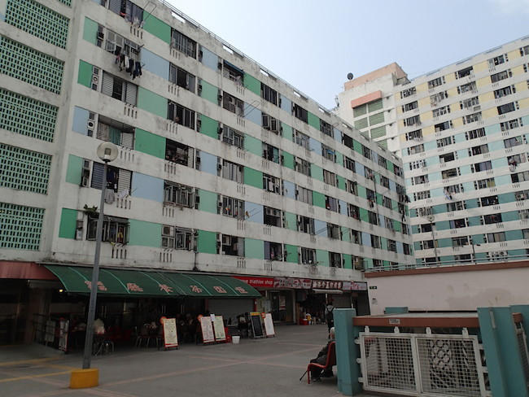
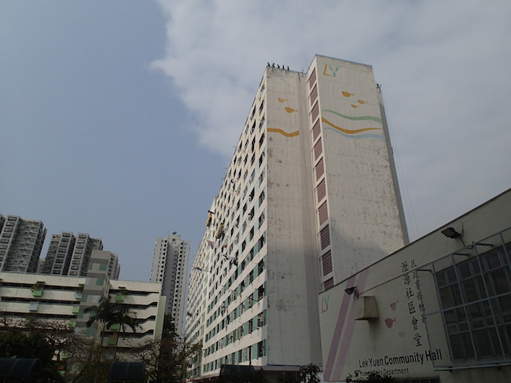
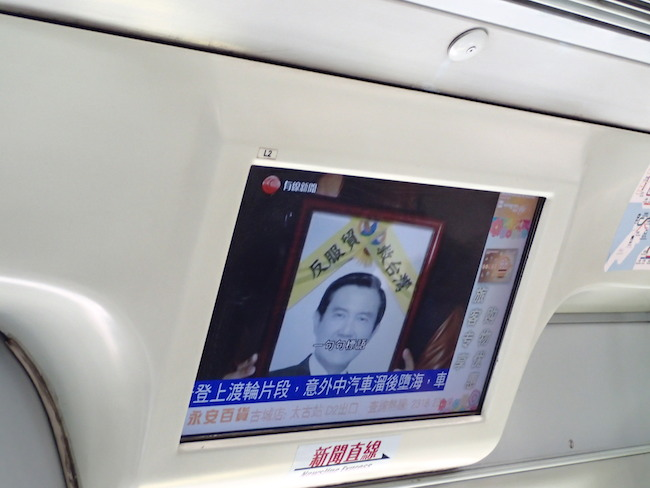
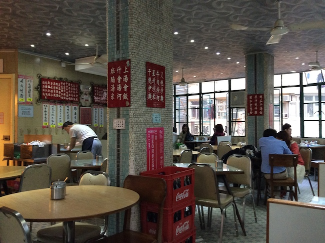
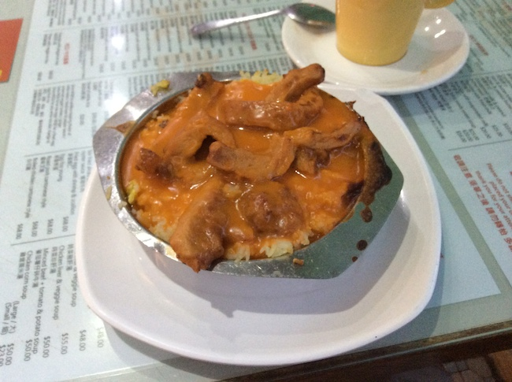
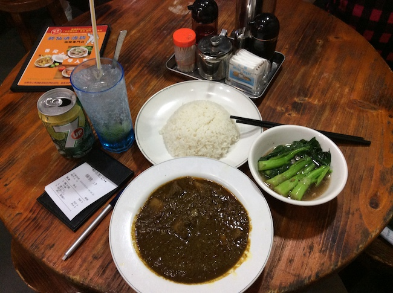
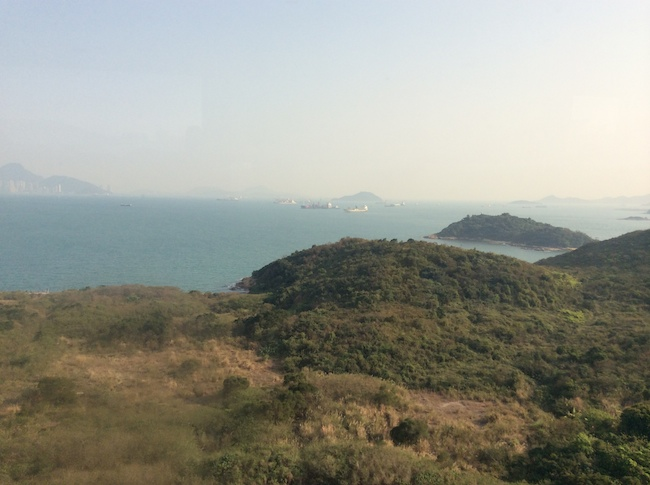

我喜歡香港，雖然也不是愛逛街，也不是愛美食，不喜歡到處都是人擠人，高樓大廈還擋住了天空... 但是香港混雜多元的文化卻一直令我著迷。

這次來香港主要是為了一個很喜歡的斯洛維尼亞（前南斯拉夫）樂團 [Laibach](http://www.laibach.org/)！

<!-- more -->

## 2014-03-22 (六)

早上坐 6:10 的飛機，8點多出機場。剛好錯過一班到旺角的巴士，想說時間還早，就隨便搭一班準備離開的巴士，於是就坐到沙田去了。

沙田站一出來也是很多人，到處亂走，跟著人群亂走，看到很多人走到一個像社區的大樓，寫著一個牌子[瀝源邨](http://zh.wikipedia.org/wiki/瀝源邨)，原來就是香港有名的公共屋邨，我這個觀光客就好奇的到處亂逛。

早上的時間很悠閒，大部份都是老人坐在椅子上曬太陽。

地鐵的電視也會播著台灣的服貿事件。

前幾天因為服貿事件，都沒睡好，其實很累。進去旅館後就熟睡了3個小時，然後去找旺角的戶外用品店：The Overlander、毅成，在人群中穿梭很累。

下午肚子餓，走到廟街底朋友介紹的[美都餐室](http://zh.wikipedia.org/wiki/美都餐室)，非常老派，我喜歡，坐在窗邊看著樓下的廟前的榕樹廣場，終於享受到度假的悠閒，榕樹上全部都是鳥叫聲，好像泡完溫泉般的舒坦。

焗排骨飯

然後就坐地鐵到灣仔，這次來香港的目的，Laibach！

場地是很特別教堂和展演空間 The Vine，場地聲光效果很棒，累了後面有電影院的椅子可以坐（適合無法久站的搖滾客）。

看到 Laibach 前面幾首早起的歌還是很難相信，我竟然親眼看到了！因為從來沒想過會有人請他們來亞洲（日本除外）。雖然加入女主唱後的歌不太習慣，但是也是唱了很多經典歌曲，好嗨森啊。

<iframe width="560" height="315" src="//www.youtube.com/embed/e-5L_z8P12A" frameborder="0" allowfullscreen></iframe>

<iframe width="560" height="315" src="//www.youtube.com/embed/HFIcqBBow28" frameborder="0" allowfullscreen></iframe>

- [The Vine Church - Hong Kong](http://www.thevine.org.hk/)
- [Laibach (band) - Wikipedia](http://en.wikipedia.org/wiki/Laibach_(band))

回旅館累癱睡死。

## 2014-03-23 (日)

本來想要在香港跑步一下，也因為太累放棄。白天一樣到旺角西洋菜街、通菜街一帶亂逛，Chamonix賣比較多技術裝備，不過我也沒需要什麼東西。

巴基斯坦咖哩好辣好好吃！（我只點小辣，如果沒有那杯鹹檸七我應該會受不了）

回程也是悠閒的巴士，不趕時間就坐客運，慢慢欣賞風景嘍。

---

**住宿:** 香港太子旺角維景酒店

**戶外用品店:**

- [The Overlander](http://www.overlander.com.hk/home) — 旺角彌敦道610號荷李活商業中心12樓
- [毅成](http://www.alink.com.hk/) — 香港亞皆老街24-26號東方大廈5及6樓
- [Chamonix](http://www.chamonix.com.hk/) — 九龍旺角奶路臣街6號A地下及1樓

**伴手禮:** [珍妮曲奇 Jenny Bakery](http://www.jennybakery.com/)

**Laibach 相關:**

- [袁智聰唱片箱: Laibach 萊巴赫幽靈光環](http://yccmcb.blogspot.tw/2014/03/laibach.html)
- [袁智聰唱片箱: Laibach 萊巴赫軍團佔領香港](http://yccmcb.blogspot.hk/2014/03/laibach_24.html)
