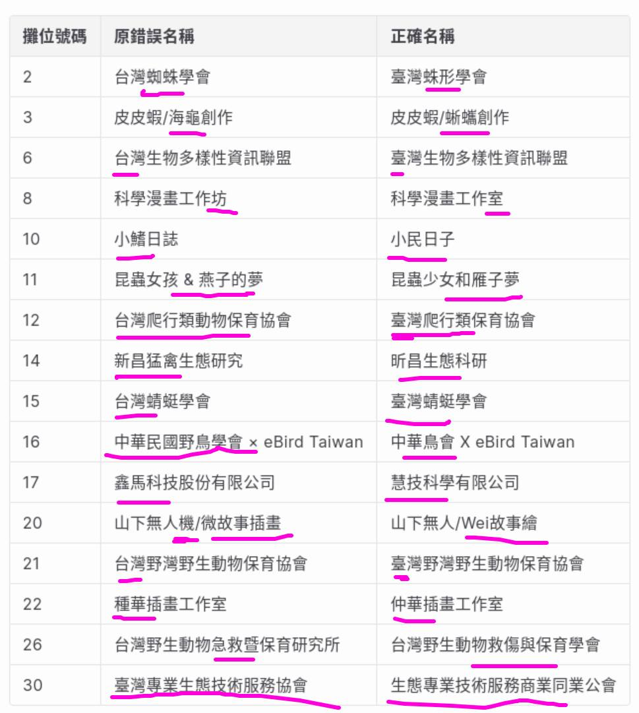

<style>
pre code {
  white-space: pre-wrap !important;
  word-wrap: break-word !important;
}
</style>

# 2026 CABE會議 - 手機網頁 - AI製作流程

分享一下這次用AI作[2026 動物行為暨生態研討會](https://ntnu.tapmeeting.com/Home)手機網頁版呈現，真的只是用很基本使用，沒有複雜的AI指令，原汁原味重現prompt指令供大家參考(也順便可以笑一下我的英文很爛)。


[原始碼](https://github.com/moogoo78/CABE-2026) | [呈現頁面](https://moogoo78.github.io/CABE-2026/)

<!-- more -->

週六早上本來準備看Alex Honnold攀爬101的轉播，但因天候不佳延期，空出來的時間突然想看一下CABE 2026的議程，雖然官網的議程非常詳細清楚，Facebook也有提供Excel檔下載，但是用手機小畫面看還是覺的有點辛苦。看一下訂閱的Claude Code的token還有額度，就想叫他動起來做點事了。


## 使用環境

- Claude Code (命令列界面)，Model: 一開始用Opus 4.5、後來發現token燒太快改用Sonnet 4.5，可能也不是太複雜的東西，覺的Sonnet就夠用了。
- 用英文指令: 可以比較精準用網頁開發的專有名詞溝通。
- 然後大部分都是一直按Enter繼續。


## Prototyping

首先我請它先做一個適合手機觀看的靜態網頁試試看：

```text
make a static html, that can easily view the conference timeline, with different session room at the same time, mainly for mobile view
```

關鍵字是**static html**，希望用最基本的 HTML、CSS 跟 JavaScript 就可以做到，不需要用後台程式、資料庫或是前端套件，盡可能單純，讀取速度也快。

做完後，看著結果覺得差不多八成就是這樣了，再餵給它議程Excel檔( [2026 動行口頭議程 網路版 - Google 試算表](https://docs.google.com/spreadsheets/d/1NZxx1F4ZJ92toXEPNL-nl0q-xR7nFcu8q3ccuML0Awg/edit?fbclid=IwY2xjawPhz-xleHRuA2FlbQIxMABicmlkETFTOGw0MkQzdkJoeURmbjBOc3J0YwZhcHBfaWQQMjIyMDM5MTc4ODIwMDg5MgABHoTnaF2rlNC7sLUJv-gCl1N8CnAfnndFqUDc8NRulqh_FksUN0hwH1GhMjvY_aem_8Qszs5cS7ChISz9m2I1z_g&brid=gvi4Hog2kmya4Z6qMoyweQ&gid=1817172701#gid=1817172701) )，讓它去讀裡面真正的議程內容。我也是怕他一開始讀了一堆議程內容，如果方向錯誤又要來回調整很麻煩又浪費token，所以先確定洞有挖好，再來填真實內容。


```text
read real detail data from the xlsx
```

它只讀了第一個Sheet，是研討會大概的流程。其他的細節時間依不同場地列在其他每一個Sheet裡，所以也請他把其他Sheet內容擷取出來。

```text
the xlsx other sheets has detail
```

以前處理資料的工程師最討厭Excel合併儲存格，合併儲存格是為了人類了視覺方便閱讀，寫程式去擷取資料會需要花一點功夫整理，現在用LLM在閱讀這樣子的內容的時候，它其實像人類一樣可以理解這些資料，結構完全不是問題，簡單一句話就把事情做完了。

## 進階功能

增加搜尋功能

```text
add a simple search
```

增加篩選功能(Filter)，用場地(教室)名稱跟內容主題當作篩選條件。

而這個研討會的情境是教室跟主題綁在一起的。(也就是大致上用教室或主題篩選出來的結果是一樣的)

```
each session (E201, E202, E301, E302, B101, B102) has topic (category), ref topic.txt, please add for display and can filter
```

### 攤位資訊

本來想說作到這樣就好了，結果收到需求說要增加攤位資訊，因此就去原始網頁把攤位平面圖擷下來，然後叫AI放進網頁，攤位圖只有編號，叫AI去原始網頁找對應的攤位名稱。

```text
make an other area for booth info (booth.png is the map), and the booth number and the external url is in this page https://ntnu.tapmeeting.com/Booth
```

做完後我也沒有檢查，完全相信。結果...**攤位名稱全錯！**

發現是AI自己去讀攤位名稱內的連結，然後沒人跟他說，他卻去*理解*並且*轉譯*成新名稱，有些是用同音字取代，總之也錯的離譜。

```text
booth section的名字很多都錯了, 來源: https://ntnu.tapmeeting.com/Booth 請複製貼上就好, 不要重新翻譯
```

請它自己列出錯誤清單，好讓我放到人類的社群媒體笑他：


```text
make a error list in booth-error.md
```


<figure markdown="span">
  { width="500" }
  <figcaption>大錯特錯</figcaption>
</figure>


### 加一點連結

加上原始網站連結

```text
make a like to official home pgae: https://ntnu.tapmeeting.com/Home
```

加上問題回報連結

```text
make a 問題回報 link to github repo issues
```

### 分類

然後接下來就是收到一些需求，譬如說可以用"專題演講"和"工作坊/論壇"

要加上主題的篩選。

這其實原本資料就有了，只是在製作過程中也許被 AI忽略了。再叫他加進去就可以了。

```text
make another category "專題演講 | Plenaries", "口頭報告 | Presentations" and "工作坊/論壇 | Workshops/Forums", above the room and topic, the room E101 and B103 is belongs to workshops/forums; 中正堂, S101國家公園 and E102 林保署 is belongs to Plenaries
```

### 海報區

比較麻煩的是poster

怕他把原來的改亂，先請他做一個示範，看起來沒問題後就給他excel匯出的文字，做成2天的海報專區。

```text
make a poster tab, read poster-d1.csv and poster-d2.csv and display on poster tab, how you suggest the layout
```

原本是條列式的，覺的用卡片顯示的比較好看，所以請他改。

```text
make card grid
```

但發現這樣查找資料的時候，變成非常的分散，你必須譬如說查找某個人名，他只會在某一區出現，然後我們要做的就是把這個情境講得清楚，就是把 poster當成一個時間的區間，一個在原本行程表可以顯示佔據一段時間的*time box*。

```text
make poster tab as one "類型" not another tab
```

調整時間顯示

```text
poster category no need sub-tabs, only use main day 1, day 2 tabs
add poster session card in day1 and day2, timeline is day1 ->  12:30 - 19:00, day2 -> 08:30 13:00
```

發現一些問題請他改

```
Day 2 need add a green box (Poster session) 12:30-19:00, 8:30-13:00
why I after clicking "Day 2" tab, the "green box" in "Day 1" is disappear
still can not see it
```

## 最後補充

### 增加議程編號

議程的前頭開頭沒有呈現編號，每一軌議程的 ID，所以也幫他請他幫忙加進去，這算是補充資料的部分。

```text
reference "2026 動行口頭議程 網路版.xlsx" each sheet, add "編號" (ex: OA01, NP01, FA01, 論壇01...) to each title
```

然後還有一個是要把林保署專區國家公園署專區特別區分出來。

```text
add 2 topics (主題) to nav filter bar: 林保署專區(room E102) and 國家公園署專區(room S101)
```

移到選單最前面。

```text
move these 2 new topic to first of nav (left most)
```

### Eco Plus! 說明會

最後就是活動當天旻萱傳給我一個希望加上台積電獎學金的一個臨時的議程，網頁上也沒有，但是有我一張手機拍照海報的圖檔。我就直接丟這個圖檔讓 AI去判斷，然後就在議程表裡加了一個新主題。

```text
read the eco-plus folder, add a timebox for "台積電 Eco Plus! 生態共融獎學金暨提案獎說明會"
```

然後也加上了一個小 icon表示它跟其他的議題內容有一點不同。

```
add this "說明會" to "類型" botton: "Eco Plus! 獎學金獎說明會"
move this button to last order and give it a unicode emoji
```

差不多就這樣了。


<figure markdown="span">
  { width="240" }
  <figcaption>That's It</figcaption>
</figure>


從頭到尾跟AI對話的時間可能大概不到2小時，花最多時間是寫這篇文章。
