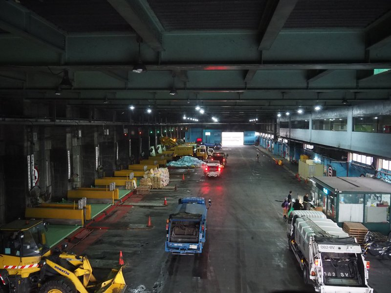

# 參觀北投焚化爐

在臉書社填海社看到揪團看[焚化爐活動](https://www.facebook.com/share/p/1AdzTWL7GR/)，結果報名十分踴躍還分成2隊，我們是跟著RE-THINK團隊，大家果然都是對垃圾議題非常有興趣的，問題非常多，也都問的很深入。

以下是當場聽到隨手抄的筆記整理，很有可能聽錯或記錯，請斟酌參考。

## 台北市的垃圾

- 台北市目前每垃圾量為2200-2500公噸，包含事業廢棄物(不是藍袋子的家庭垃圾都算) => 1人每天垃圾量0.8-1公斤
- 實施垃圾分類前每天為3500公噸

## 焚化爐

- 台灣目前26座焚化爐
- 除了台北市跟高雄市外，焚化爐都是公辦民營
- 除了台北市外，沒有一個縣市可以完全焚燒 (**新百岳**)
- 台北市有三個焚化爐
  - 內湖: 600噸
  - 木柵: 1300噸
  - 北投: 1500-1600噸
- 各縣市垃圾由中央調配，但因為地方自治法，地方可以拒絕

### 北投焚化爐

- 以前是士林區，後來劃分成北投區
- 9、10、11月做歲修，其他焚化爐輪流
- 北投焚化爐有4個爐 <!-- 1800 -->
- 當初設定20年，現在已超過5年
- 設備老舊，燃燒的垃圾種類也跟現在的不一樣
- 香港蓋一個新的可以每天燒3000噸，費用高
- 當年花80億蓋
- 曾經幫基隆、南投、雲林燒，現在沒有了
- 83% 燃燒率
- 幫外縣市燒的話，會還他灰，1:1的比例，飛灰處理更貴
- 每天400多台車進來

<!-- - 1公噸 8000元-->

## 廚餘

- 130-150噸廚餘
- 目前有機肥
- 新北市有做黑水虻(比例很低)
- 廚餘水除掉，剩不到一半重量，弄乾切小塊，剩更少。送到木柵焚化爐後山。

<!-- 一天2000t -->

## 底灰

- 市政工程有規定要用40%底渣
- 地磚用回收料、成本很高，要有補助才會有廠商做

## 其他

- 1.5噸卡車，裝潢廢棄物丟棄費用破萬
- 完全不能燒的: PVC(但是家裡丟出來的還是會燒到)跟醫療廢棄物(有放射線)
- 代清業者，一噸收3600元?
- 檢查，一袋30個寶特瓶以上就要罰6000元，其他有的可能3個月不能進來，整車退運
<!-- 講者一天最多開27張罰單，會放寬 -->
- 台中醫療廢棄物1公斤，25-30元
- 公告的回收物跟清潔隊的認定可能不同，例如：乾淨的保麗龍跟塑膠袋，怎樣算乾淨的
- 理論上不會有味道，臭味都是垃圾中有餿水漏出來
- 金紙處理: 週六內湖專爐專燒，每年有淨爐儀式
- Q: 垃圾會燒起來嗎 A: 每年夏天都會燒起來 (會請消防局來噴水)

**給大家的建議：做好回收**

<figure markdown="span">
  
  <figcaption>垃圾車傾倒的地方</figcaption>
</figure>

<figure markdown="span">
  
  <figcaption>集中一起燒的金紙</figcaption>
</figure>

<figure markdown="span">
  
  <figcaption>目前垃圾量算很少的</figcaption>
</figure>

<figure markdown="span">
  
  <figcaption>超大型夾娃娃</figcaption>
</figure>

<figure markdown="span">
  
  <figcaption>垃圾要一直翻動，讓他稍微乾燥一點，比較好燒</figcaption>
</figure>

<figure markdown="span">
  
  <figcaption>廢氣監控，講者說他沒有遇到超標過</figcaption>
</figure>
