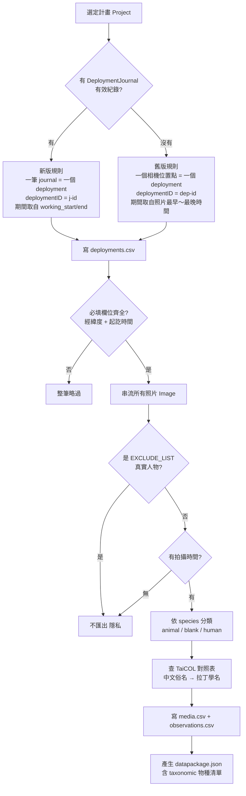

# 把自動相機資料匯出成 Camtrap DP 的過程筆記

最近在處理把「自動相機影像資料庫」的計畫資料匯出成 [Camtrap DP](https://camtrap-dp.tdwg.org/) 標準格式，記錄一下遇到的狀況與處理方式。

(90% 內容由Claude Opus 4.8撰寫)

<!-- more -->

Camtrap DP（Camera Trap Data Package）是 TDWG 訂的自動相機資料交換標準，一個計畫匯出後是一個資料夾，裡面有四個檔案：

| 檔案 | 內容 | 一列代表 |
|------|------|----------|
| `datapackage.json` | 計畫描述、授權、聯絡人 | （整包的詮釋資料）|
| `deployments.csv` | 相機佈設紀錄 | 一台相機在某地點、某段期間的運作 |
| `media.csv` | 影像檔 | 一張照片 |
| `observations.csv` | 物種辨識結果 | 一筆辨識 |

## 先搞懂三個層級的對應

最一開始最容易搞混的，是「deployment」到底對應到我們資料庫的哪一層。整理成這張表才想清楚：

| TaiCAT | Camtrap DP | DarwinCore | 白話 |
|--------|-----------|-----------|------|
| `Deployment`（相機位置點，有經緯度）| **deployment** | ≈ Event | 哪台相機、架在哪、架多久 |
| `DeploymentJournal`（一次回收作業的工作期間）| **deployment**（更細）| ≈ Event | 這次架設從何時到何時 |
| `Image`（一張已辨識的照片）| **media** + **observation** | ≈ Occurrence | 拍到什麼 |

重點是 **deployment 是「採樣事件」層級，不是「單張照片」層級**。就像 DarwinCore 裡許多 Occurrence 共用一個 Event，這裡也是許多照片共用一個 deployment。

## 整體流程



## 兩種匯出規則：新版 vs 舊版

程式會先判斷該計畫有沒有 `DeploymentJournal` 資料，再決定走哪一套。

**新版計畫**：近期透過桌機上傳工具，每次回收都會建立一筆 `DeploymentJournal`，記錄該次架設的起訖時間。所以**一筆 journal = 一個 deployment**，同一個樣點有多次架設就會拆成多個 deployment，比較精確。

**舊版計畫**：早期只有照片，沒有架設作業的起訖時間紀錄。這時就改成**一個相機位置點 = 一個 deployment**，工作期間用該位置點「所有照片的最早與最晚拍攝時間」推算。

舊版這個選擇其實是想過幾種做法才定下來的：

| 做法 | 問題 |
|------|------|
| 整個計畫當成 1 個 deployment | Camtrap DP 規定每個 deployment 只能有一組經緯度，合併後座標失去意義 ❌ |
| 每張照片各當成 1 個 deployment | deployment 是一段期間不是瞬間，會產生大量長度為 0 的 deployment ❌ |
| **一個相機位置點 = 1 個 deployment** | 保留各樣點真實座標與合理期間 ✅ |

!!! note "舊版的已知限制"

    用「最早～最晚照片時間」當期間，若同一個樣點其實跨越多次回收（中間有停機空檔），這些會被合併成一段連續期間，可能略為高估工作天數。未來若要更精確，可依照片時間軸上的「長空檔」自動切分。

## 最麻煩的部分：測試照、空拍、人員照

TaiCAT 沒有獨立欄位標記「這是不是測試照」，而是把這類資訊塞在**物種（species）欄位**裡，例如「測試」「空拍」「工作照」。所以不能傻傻地把所有非空白的標籤都當成動物——否則光是「空拍」「測試」就有上千萬筆會被誤標成 `animal`，整個污染掉物種分析。

研究這部分時也修正了我一開始的誤解：Camtrap DP **沒有** `cameraSetup` 這個欄位，正確的欄位名是 **`cameraSetupType`**，而且不是布林值，是一個只有兩個值的控制詞彙：`setup`（架設／回收動作）與 `calibration`（校正動作）。它跟 `observationType`（`animal`/`human`/`blank`…）是兩個獨立的欄位。

整理出來的對應規則：

| TaiCAT species 標籤 | 是否匯出 | observationType | cameraSetupType | captureMethod |
|---|---|---|---|---|
| 真實物種（水鹿、山羌…）| ✅ | `animal` | （空）| activityDetection |
| 空拍 / 錯誤空拍 | ✅ | `blank` | （空）| activityDetection |
| 測試 / test（定時測試幀）| ✅ | `blank` | （空）| **timeLapse** |
| 工作照 / 收相機（架設回收人員照）| ✅ | `human` | `setup` | activityDetection |
| **人 / 獵人 / 研究人員（EXCLUDE_LIST）** | **❌ 不匯出** | — | — | — |

!!! note "為什麼測試照不標 `calibration`？"

    一開始我把「測試」標成 `cameraSetupType=calibration`，後來拿掉了。Camtrap DP 的 `calibration` 指的是「校正動作」（拿距離標桿在鏡頭前比對那種），不是定時自拍的「相機還活著」確認幀；而且它會跟 `media.captureMethod=timeLapse` 完全重複。所以測試照只靠 `timeLapse` 標記，`cameraSetupType` 留空。但 `setup`（工作照／收相機）一定要保留——那些是位移觸發（`activityDetection`），`media` 看不出來是架設／回收，只有 `cameraSetupType` 能標。

三個關鍵決策：

1. **真實人員照不公開，但仍用於計算工作期間**。偶然入鏡的真實人物（含獵人）基於隱私不匯出成 media／observation，但在舊版規則中這些照片**仍會計入 deployment 的最早～最晚時間**——因為它們同樣證明相機當時在運作。也就是 EXCLUDE_LIST 資料只用來界定工作期間，不對外公開。

2. **測試照／架設照保留但加註記**，不刪除。因為它們界定了相機的工作期間（第一張架設照、最後一張收相機照剛好是兩端）。標記 `cameraSetupType` 後，使用者做物種分析時可以濾掉，但仍能用它們算工作時間。

3. **原始中文標籤逐字保留**。凡是沒對到拉丁學名的列（測試、空拍、工作照…，還有對不到的動物泛稱），原始中文 `species` 標籤都會原樣寫進 `observationComments`——類似 Darwin Core 的 verbatim 概念，原始辨識不遺失。已對到學名的動物就不重複，中文名放在 `taxonomic` 的 `vernacularNames`。

!!! tip "工作時間怎麼算？"

    Camtrap DP **不直接儲存工作天數**，而是由使用者從 `deploymentStart → deploymentEnd` 推算。所以測試照的角色是去界定這段期間，而不是自己攜帶工作天數。

## 中文俗名 → 學名：接上 TaiCOL

還有一個少不了的步驟：TaiCAT 的 `species` 欄位存的是**中文俗名**（山羌、水鹿…），但 Camtrap DP 規定 `observations.scientificName` 要放**拉丁學名**，中文俗名得另外放到資料包的詮釋資料裡。所以匯出前要先做一次名稱對應。

我用 [TaiCOL](https://taicol.tw/)（台灣物種名錄）的 taxon API，拿中文俗名去查學名與 taxon id，整理成一份對照表 `species-taicol-map.csv`，再人工校正。對應結果分三個地方放：

| 名稱 | Camtrap DP 欄位 |
|------|----------------|
| 拉丁學名 | `observations.scientificName` |
| TaiCOL taxon id | `datapackage.json` → `taxonomic[].taxonID` |
| 中文俗名 | `datapackage.json` → `taxonomic[].vernacularNames.zho` |

`taxonomic[]` 是資料包層級的物種清單，每個出現過的學名一筆：

```json
{
  "scientificName": "Muntiacus reevesi",
  "kingdom": "Animalia",
  "taxonID": "t0096460",
  "vernacularNames": { "zho": "山羌" }
}
```

（俗名語言代碼 `zho` 是 ISO 639-3 的中文。）

查 API 時踩到一個有趣的坑：用 `common_name=老鼠` 去查，竟然回傳 39 筆**魚**（䲗科，「老鼠」是牠們的俗名之一）。所以對應規則要保守——學名必須真的掛著這個中文名（精確比對），而且只在「唯一一筆」時才採用，避免泛稱亂對。像「獼猴」「松鼠」這種泛稱、TaiCOL 只收全名（臺灣獼猴、赤腹松鼠），就會對不到。

對不到學名的標籤（泛稱、或「白腹秧雞(白胸秧雞)」這種帶註解的字串）怎麼處理？

- `observationType` 仍是 `animal`（確實是動物，只是沒對到學名）
- `scientificName` 留空（不能塞中文，否則違規）
- 原始中文標籤保留到 `observationComments`，辨識結果不遺失

## 順手補上相機型號

兩種規則都會嘗試從 `taicat_image_info` 的 `exif` 欄位補上相機廠牌型號（`cameraModel`）。每個 deployment 取一張代表照片，讀 EXIF 的 `Make`／`Model`，輸出成 `RECONYX-HC500 HYPERFIRE` 這種格式。

這裡有個效能陷阱：`taicat_image_info` 沒有對 `image_uuid` 建索引，如果每個 deployment 各查一次就會對上千萬列做一次全表掃描。所以改成把所有 deployment 的代表照片 uuid 收集起來，**一個計畫只發一次 `IN` 查詢**。

## 別忘了必填欄位

最後做 schema 稽核時發現，Camtrap DP 有些欄位是必填的：deployment 的經緯度、工作起訖時間；media 的時間戳。如果資料缺漏（例：行程沒有工作期間、位置點完全沒照片、照片沒拍攝時間），直接寫空字串會讓整包資料無法通過驗證。

實際對資料庫一查，果然有：21 筆沒有工作期間的行程、843 個沒有任何照片的位置點、25,355 張沒有拍攝時間的照片。處理方式是**整筆略過不匯出**——反正這些缺資料的 deployment 本來就沒有照片，沒有東西會掉。

!!! warning

    這次只用自己寫的小腳本檢查了必填欄位與控制詞彙，還沒跑過正式的 `frictionless validate`。要做到完全符規範，之後應該裝 `frictionless` 對產出的 datapackage 跑一次完整驗證，才能抓出座標範圍、日期格式之類我沒機器檢查到的問題，先放個 `TODO`。

## 參考資料

- [Camtrap DP](https://camtrap-dp.tdwg.org/)
- [Camtrap DP — Data](https://camtrap-dp.tdwg.org/data/)
- [observations table schema](https://raw.githubusercontent.com/tdwg/camtrap-dp/1.0/observations-table-schema.json)
- [TaiCOL 台灣物種名錄](https://taicol.tw/)
- [Darwin Core](https://dwc.tdwg.org/terms/)
