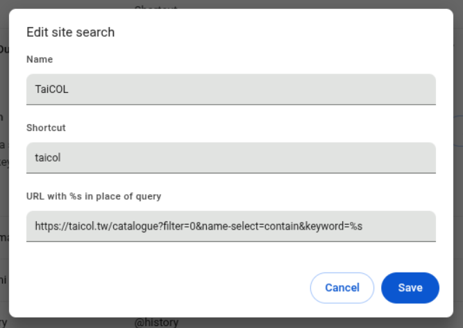
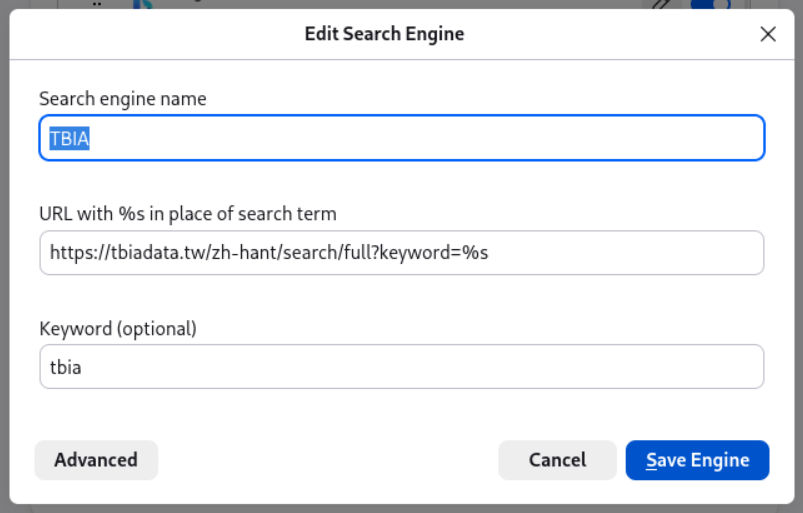
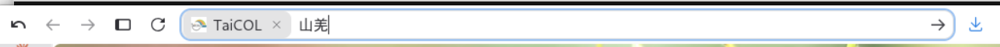

# 瀏覽器的自訂搜尋

這不是什麼新技術，很多瀏覽器在N年前就可以設定這個功能了。從網址列直接打`自定的搜尋網站名稱`跟`關鍵字`，然後就可以直接進入該網站的搜尋結果頁。常常忘記這個好用的功能。

<!-- more -->

## 設定方式

1. 先到那個網站，正常搜尋一次（例如搜「臺灣獼猴」）。
2. 看網址列，如果網址裡出現了關鍵字，表示這個網站可以做這件事。
3. 把網址裡關鍵字的那一段換成 `%s`。

!!! warning "不是每個網站都可以"
    有些網站的搜尋是用 POST 送出，或是完全用前端狀態管理（網址不會變），那網址列就看不到關鍵字，這招就沒辦法用。搜尋後網址有變、且能直接貼給別人打開，才是可以的。

## 以TaiCOL、TBIA、TBN網站為例

把搜尋的關鍵字（中文可能會被URL encode編碼過 `%E8%87%BA%E7%81%A3...`，不影響結果不用擔心）換成`%s`。

| 站台 | 網址 |
|---|---|
| [TaiCOL](https://taicol.tw) 台灣物種名錄 | `https://taicol.tw/catalogue?filter=0&name-select=contain&keyword=%s` |
| [TBIA](https://tbiadata.tw) 台灣生物多樣性資訊聯盟 | `https://tbiadata.tw/zh-hant/search/full?keyword=%s` |
| [TBN](https://www.tbn.org.tw) 台灣生物多樣性網絡 | `https://www.tbn.org.tw/taxasearch/result?name=%s` |

Chrome系列跟Firefox系列瀏覽器的設定和使用方式都差不多：

Chrome選單: Settings -> Search engine -> Manage search engines and site search 或是直接在網址輸入 `chrome://settings/searchEngines`
Firefox選單: Settings -> Search -> Additional search engines 或是直接在網址輸入 `about:preferences#search`

<figure markdown="span">
  
  <figcaption>Chrome系列</figcaption>
</figure>

<figure markdown="span">
  
  <figcaption>Firefox系列</figcaption>
</figure>

設定完之後，在網址列打：

```
tbia <Tab> 臺灣獼猴 <Enter>
taicol <Tab> Macaca cyclopis <Enter>
```

按下 <kbd>Tab</kbd> 後網址列會變成「Search TaiCOL」的模式，這時候打的字都會被當成關鍵字送出去。

<figure markdown="span">
  
</figure>


## 延伸使用

**常用的服務都可以設一設**。同樣的方法對 GBIF（`https://www.gbif.org/search?q=%s`）、iNaturalist、Wikispecies 也都適用，做法完全一樣。
